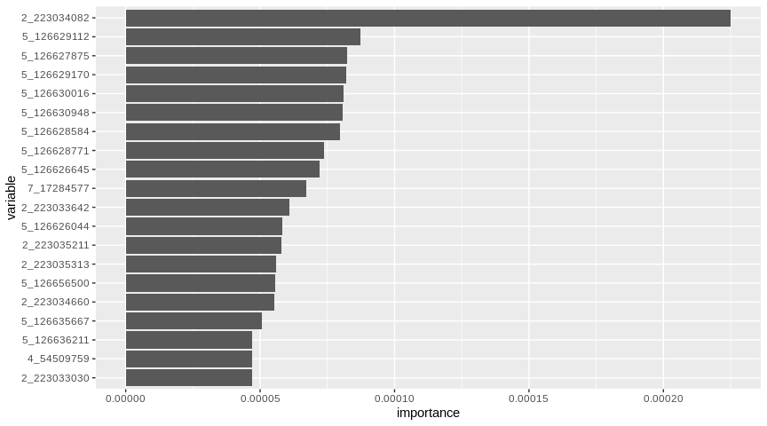

A sparklyr extension for VariantSpark
================

VariantSpark is a framework based on scala and spark to analyze genome datasets. It is being developed by [CSIRO Bioinformatics](https://bioinformatics.csiro.au/) team in Australia. VariantSpark was tested on datasets with 3000 samples each one containing 80 million features in either unsupervised clustering approaches and supervised applications, like classification and regression.

The genome datasets are usually writing in Variant Call Format (VCF), a specific text file format used in bioinformatics for storing gene sequence variations. So, VariantSaprk is a great tool because it is able to read VCF files, run analyses and give us the output in a spark data frame.

This repo is an R package integrating R and VaraintSpark using the [sparklyr](https://github.com/rstudio/sparklyr). This way, you are able to analyze huge genomics datasets without leaving your well know R environment.

Installation
------------

To upgrade to the latest version of variantspark, run the following command and restart your R session:

``` r
install.packages("devtools")
devtools::install_github("samuelmacedo83/variantspark")
```

Connect to Spark and VariantSpark
---------------------------------

To use variantspark R package you need to create a VarianSpark connection, to do this, you have to pass a Spark connection as an argument.

``` r
library(sparklyr)
library(variantspark)

sc <- spark_connect(master = "local")
vsc <- vs_connect(sc)
```

Load datasets
-------------

VariantSpark can load VCF files and other formats too, like CSV for example.

``` r
hipster_vcf <- vs_read_vcf(vsc, "data/hipster.vcf.bz2")
hipster_labels <- vs_read_csv(vsc, "data/hipster_labels.txt")
labels <- vs_read_labels(vsc, "data/hipster_labels.txt") # read just the label column
```

Importance analysis
-------------------

This is one of VariantSpark application and this analysis was based on [this](https://docs.databricks.com/applications/genomics/variant-spark.html). Briefly, VariantSpark uses Random Forest to assign an "Importance" score to each tested variant reflecting its association to the interest phenotype. A variant with higher "Importance" score implies it is more strongly associated with the phenotype of interest. For more details, please look at [here](https://variantspark.readthedocs.io/en/latest/overview.html#importance-analysis). This is the way you can do it in R.

``` r
# calculate the "Importance"
importance <- vs_importance_analysis(vsc, hipster_vcf, labels, n_trees = 100)

# transform the output in a tibble spark
importance_tbl <- importance_tbl(importance) 
```

Plot the results
----------------

You can use `dplyr` and `ggplot2` to transform the output and plot!

``` r
library(dplyr)
library(ggplot2)

# save a importance sample in memory
importance_df <- importance_tbl %>% 
  arrange(-importance) %>% 
  head(20) %>% 
  collect()

# importance barplot
ggplot(importance_df) +
  aes(x = variable, y = importance) + 
  geom_bar(stat = 'identity') +          
  scale_x_discrete(limits = importance_df[order(importance_df$importance), 1]$variable) + 
  coord_flip()
```



Disconnect
----------

Don't forget to disconnect your session when you finish your work.

``` r
spark_disconnect(sc)
```
